# Aethelgard Inventory and Progression Save/Load State Machine

## Scope

This state machine defines how the Android local profile and future cloud-authoritative profile load, mutate, save, recover, migrate, and synchronize inventory, equipment, quest, and progression state. The database schema is in [`aethelgard_inventory_progression.sql`](aethelgard_inventory_progression.sql). The same logical rules apply to the current Kotlin/C++ prototype and the future Unreal dedicated-server path.

## State overview

```mermaid
stateDiagram-v2
    [*] --> Uninitialized
    Uninitialized --> Loading: boot(profileId)
    Loading --> Migrating: schemaVersion < current
    Loading --> Validating: schemaVersion == current
    Loading --> Recovering: primary snapshot invalid
    Migrating --> Validating: migration succeeds
    Migrating --> Corrupt: migration fails
    Recovering --> Validating: backup checksum valid
    Recovering --> Corrupt: no valid snapshot
    Validating --> Ready: invariants pass
    Validating --> Repairing: repairable invariant failure
    Repairing --> Ready: repair committed
    Repairing --> Corrupt: repair impossible
    Ready --> Mutating: inventory/progression request
    Mutating --> Ready: request committed
    Mutating --> Ready: request rejected
    Ready --> Saving: checkpoint or lifecycle pause
    Saving --> Ready: atomic save succeeds
    Saving --> SaveRetry: transient write failure
    SaveRetry --> Saving: backoff retry
    SaveRetry --> Ready: retry budget exhausted; keep memory state
    Ready --> Syncing: authenticated sync requested
    Syncing --> Ready: sync succeeds
    Syncing --> Conflict: revision conflict
    Conflict --> Ready: merge/rebase accepted
    Conflict --> Ready: local version retained
    Ready --> Closed: activity/process shutdown
    Corrupt --> NewProfile: player accepts reset
    NewProfile --> Ready: starter profile created
    Closed --> [*]
```



## State definitions

| State | Entry condition | Allowed operations | Exit condition |
|---|---|---|---|
| `Uninitialized` | Process starts or profile changes | None | A profile ID and device ID are available |
| `Loading` | Read primary profile and latest snapshot | Read-only storage access | Snapshot is located or a recovery path is selected |
| `Migrating` | Stored schema is older than runtime schema | Versioned migration only | All migrations apply in order |
| `Validating` | Snapshot bytes and checksum are available | Structural and gameplay invariant checks | Snapshot is valid or repairable |
| `Repairing` | Optional fields missing or derived values stale | Deterministic repairs only | Repair snapshot is atomically committed |
| `Ready` | Valid in-memory state exists | UI reads, gameplay requests, saves, sync | A request, checkpoint, shutdown, or sync begins |
| `Mutating` | A gameplay/UI intent is accepted for evaluation | One serialized transaction | Commit or rejection response produced |
| `Saving` | Checkpoint, background pause, or explicit save | Serialize and atomic replace | Durable snapshot exists or retry begins |
| `SaveRetry` | A transient storage failure occurs | Bounded exponential retry | Save succeeds or warning is surfaced |
| `Syncing` | Online profile sync is requested | Revision comparison and merge policy | Remote/local revisions agree or conflict is resolved |
| `Conflict` | Remote and local revisions diverge | Deterministic conflict resolution | One authoritative revision is selected |
| `Closed` | Activity/process closes | No new mutation; final flush only | Process exits |
| `Corrupt` | No valid snapshot or safe repair exists | Export diagnostics, offer reset | New profile or user recovery path |

## Runtime state envelope

The in-memory profile must be represented by one versioned aggregate. The UI receives projections of this aggregate; it does not become a second authority.

```text
ProfileState {
  profileId: UUID
  schemaVersion: int
  stateRevision: uint64
  inventoryRevision: uint64
  progressionRevision: uint64
  level: int
  experience: int64
  experienceToNext: int64
  inventory: {
    capacity: int
    slots: [InventorySlot]
  }
  itemInstances: map<UUID, ItemInstance>
  activeLoadoutId: UUID
  equipment: map<EquipmentSlot, UUID?>
  questProgress: map<QuestId, QuestProgress>
  currencies: map<CurrencyCode, int64>
  worldMutations: map<MutationKey, WorldMutation>
  dirtyFlags: { inventory, progression, world, settings }
  lastCommittedRequestId: string?
}
```

`stateRevision` increments after any committed aggregate mutation. `inventoryRevision` increments after a backpack/equipment/item mutation. `progressionRevision` increments after XP, level, quest, currency, or reward mutation. A save snapshot records all three values. A UI snapshot must include the revisions so stale responses can be discarded.

## Load sequence

1. The application identifies the local profile and device. If no profile exists, it creates a starter profile in memory but does not claim that the profile is durable until the first atomic save succeeds.
2. The storage layer reads the current snapshot pointer, snapshot payload, checksum, and schema version. It also reads the previous snapshot pointer when available.
3. The checksum is verified before JSON/SQLite decoding is trusted. A checksum mismatch moves the machine to `Recovering`; it must not silently parse partial data.
4. The decoder validates required identifiers, stack quantities, equipment references, slot capacity, quest states, revision monotonicity, and level/XP bounds.
5. If the schema is old, migrations run in a transaction and are recorded in a migration ledger. Migrations must be deterministic and idempotent.
6. Derived stats, inventory indexes, item-definition references, and active quest projections are rebuilt from canonical records. Derived values are never trusted as primary data.
7. If optional content is unavailable, the instance is retained as an orphaned item. It becomes inspectable but not usable until a matching definition is installed.
8. A valid aggregate enters `Ready`. The UI may render only after this point.

## Mutation sequence

All gameplay mutations use this sequence, whether invoked by Android Compose, the Android native bridge, or an Unreal server command.

```text
UI/Input intent
  → requestId + base revisions
  → validate request shape
  → reject stale revision or duplicate request
  → lock profile/container/items/loadout
  → validate requirements and invariants
  → apply in-memory transaction copy
  → validate post-transaction invariants
  → append inventory_mutations ledger row
  → append progression_ledger when applicable
  → increment revisions
  → commit database transaction
  → publish new snapshot
  → return result + revisions
```

The transaction must be idempotent. A repeated `requestId` returns the original result instead of applying the operation twice. A request created from an old `baseInventoryRevision` is rejected with `ConflictStaleRevision`; the client refreshes before allowing another mutation.

### Mutation invariants

| Invariant | Rule |
|---|---|
| Ownership | Every referenced item belongs to the same profile as the request |
| Quantity | Quantity is positive and never exceeds definition `max_stack` per stack |
| Capacity | Every inventory instance has one slot or one equipment assignment, never both |
| Uniqueness | One item instance can occupy at most one equipment slot in one loadout |
| Slot compatibility | Definition `equip_slot` must match the target slot |
| Requirements | Level, quest, class, and content-version requirements pass before commit |
| Lock policy | Locked items cannot be dropped or consumed by destructive actions |
| Quest policy | Quest-protected items cannot be dropped unless the quest explicitly permits it |
| XP | Experience is non-negative after threshold processing |
| Level | Level is positive and XP threshold is recalculated from the new level |
| Revision | Successful mutations increment each affected revision exactly once |
| Audit | A committed mutation has a unique request ID and result payload |

## Save sequence

Saving uses a write-ahead/temporary-file pattern locally and a snapshot transaction remotely.

```text
Ready
  → freeze mutation queue for serialization boundary
  → copy immutable ProfileState snapshot
  → serialize canonical field order
  → calculate SHA-256 checksum
  → write temporary snapshot
  → fsync/close
  → validate temporary snapshot by reading it back
  → atomically replace current pointer
  → retain previous snapshot for rollback
  → clear saved dirty flags
  → Ready
```

Gameplay should not block on slow storage. The mutation queue may continue after an immutable copy is made, but the saved revision is displayed as pending until durable success. If a save fails, the in-memory state remains valid and `SaveRetry` retries with a bounded schedule such as 250 ms, 1 s, 4 s, and 10 s. After the retry budget is exhausted, show a non-blocking warning and retry at the next lifecycle checkpoint.

## Android local storage mapping

The Android prototype can use SQLite for normalized records plus a compact JSON snapshot for recovery. The recommended first production implementation is a single profile database file in the app’s private storage.

| Logical entity | SQLite representation | UI exposure |
|---|---|---|
| Profile | `player_profiles` | Level, profile identity, last-saved status |
| Backpack | `inventory_containers`, `inventory_slots` | 24-slot grid and capacity |
| Items | `item_instances`, `item_definitions` | Item detail, stacks, rarity, flags |
| Equipment | `equipment_loadouts`, `equipment_slots` | Paper-doll and comparison |
| Progression | `profile_progression`, `progression_ledger` | XP, level, rewards, audit |
| Quests | `quest_definitions`, `quest_progress` | Objective and completion state |
| Recovery | `save_snapshots` | No direct UI; save/recovery diagnostics |
| Mutations | `inventory_mutations` | Pending/error toasts and idempotency |

The Kotlin layer should call a repository interface such as `ProfileRepository`, while C++ or Unreal owns gameplay validation. The UI must not write these tables directly.

## Migration protocol

Every schema change receives a monotonically increasing version and a forward-only migration. A migration is applied to a copy or transaction, validated, then promoted. The system stores the last successful migration version and a checksum of the canonical profile after migration.

Example migrations:

| Version | Change | Safe fallback |
|---:|---|---|
| 1 | Starter profile, inventory slots, equipment loadout, quest progress | Create missing optional records |
| 2 | Add durability and roll seed | `durability = NULL`, `roll_seed = NULL` |
| 3 | Add accessory slots and loadout names | Create empty accessory slots and `default` loadout |
| 4 | Add world mutations and revision ledger | Empty mutation set, revision starts at current snapshot revision |

A migration may never delete an unknown item or quest record solely because the current client lacks its definition. Preserve unknown data so a later content pack can restore it.

## Conflict resolution

The offline Android prototype uses local authority. The future online profile uses server authority. When a device reconnects, compare `(profile_id, state_revision, checksum)` first. If revisions match, acknowledge. If the server is newer, download and apply. If the device has unacknowledged mutations, replay idempotent mutation records against the server revision in creation order.

Inventory conflicts are resolved at the item-instance and ledger level, not by blindly choosing the largest quantity. A server rejects a replay that references a missing or already-consumed instance. Currency and XP are ledger-based and must never be merged by summing arbitrary snapshots. World mutations use unique mutation keys and last-authoritative server acceptance.

## Error and recovery policy

| Failure | State transition | Player-facing behavior |
|---|---|---|
| Missing profile | `Loading → NewProfile` | Create starter profile and show normal game state |
| Checksum mismatch | `Loading → Recovering` | Restore last valid snapshot without silent data loss |
| Unknown item definition | `Validating → Ready` | Keep item as unavailable/orphaned; disallow use |
| Invalid equipment reference | `Validating → Repairing` | Move invalid item to first available backpack slot |
| Backpack overflow during repair | `Repairing → Corrupt` | Preserve diagnostic snapshot; request user recovery |
| Duplicate request ID | `Mutating → Ready` | Return original result; do not duplicate mutation |
| Stale revision | `Mutating → Ready` | Refresh snapshot and explain that state changed |
| Disk full | `Saving → SaveRetry` | Retry, warn without discarding in-memory state |
| Remote conflict | `Syncing → Conflict` | Show sync status; server-selected state wins |
| Process death during save | `Saving → Loading` | Use previous valid snapshot; temporary file is ignored |

## State machine acceptance tests

1. Loading a valid version-1 starter profile enters `Ready` with exactly 24 backpack slots and a valid active loadout.
2. A checksum mismatch never enters `Ready` from the invalid primary snapshot without attempting recovery.
3. Equipping an item replaces the target slot and returns the previous equipment to the same inventory transaction when capacity permits.
4. Repeating the same request ID produces one mutation ledger row and one state revision increment.
5. Replaying a stale request cannot alter quantities, equipment, XP, or quest state.
6. A failed save leaves the in-memory aggregate available and eventually promotes a valid retry snapshot.
7. A process death between temporary write and pointer replacement loads the previous valid snapshot.
8. A missing item definition preserves the item instance through save, reload, and migration.
9. XP threshold processing is deterministic across Android and Unreal implementations.
10. A remote conflict never sums arbitrary item or currency quantities; it resolves through authoritative revisions and ledgers.
